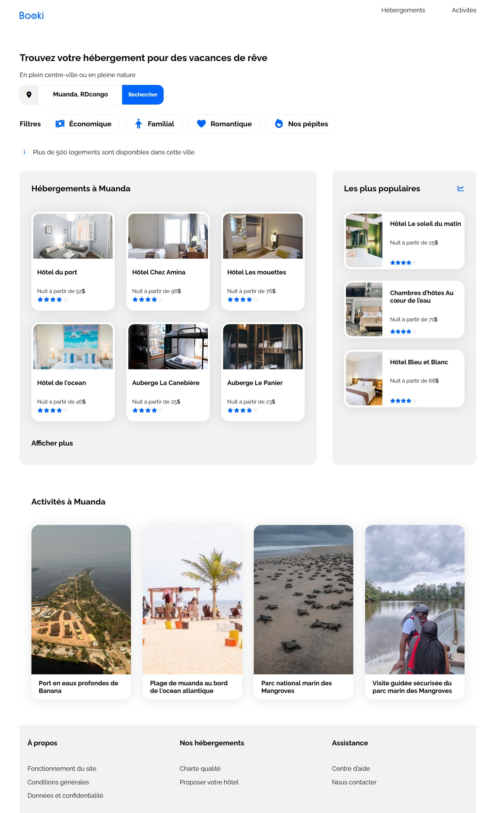
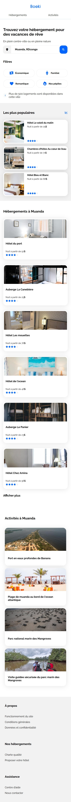

# 🌍 Booki - Agence de voyage

[](https://developer.mozilla.org/fr/docs/Web/HTML)
[](https://developer.mozilla.org/fr/docs/Web/CSS)
[](https://figma.com)
[](https://git-scm.com)

**Booki** est une plateforme de réservation d'hébergements pour des vacances de rêve.  
Ce projet a été réalisé dans le cadre de ma formation **Développeur Web** chez OpenClassrooms.

🌐 **Voir le site en ligne** : [https://M-bu-y.github.io/Booki/](https://M-bu-y.github.io/Booki/)

---

## 📋 Contexte du projet

L'objectif était d'intégrer la maquette **Booki** en HTML et CSS, avec les contraintes suivantes :

| Objectif | Description |
| :--- | :--- |
| 🎯 **Intégration fidèle** | Reproduire la maquette Figma (desktop, tablette, mobile). |
| 📱 **Responsive Design** | Adapter le site aux trois formats d'écran. |
| 🧹 **Code propre** | Utiliser HTML5 sémantique et CSS3 moderne. |
| ♿ **Accessibilité** | Balises `alt`, titres hiérarchiques, etc. |
| 🔧 **Versionnement Git** | Gérer le projet avec Git et GitHub. |

---

## 🖥️ Aperçu du projet

| Version | Aperçu |
| :--- | :--- |
| **Desktop** |  |
| **Mobile** |  |

---

## 🎨 Maquette Figma

La maquette du site a été entièrement conçue sur Figma avant l'intégration HTML/CSS.


🔗 **Lien vers la maquette interactive** : [Cliquez ici pour voir la maquette sur Figma](https://www.figma.com/design/Muv2EmTF77WNDAbK2Wj0RQ/Maquettes-Booki?node-id=3-0&t=1wfhzZS0hz4ENk7p-1)

---


## 📸 Captures d'écran

| Page | Aperçu |
| :--- | :--- |
| **Accueil Desktop** |  |
| **Accueil Mobile** |  |

> **Note** : Les versions tablette et desktop sont similaires, la version mobile est entièrement responsive.

---

## 🛠️ Technologies utilisées

| Catégorie | Technologies |
| :--- | :--- |
| **Front-end** | HTML5, CSS3 (Flexbox, Grid, Media Queries) |
| **Méthodologie** | BEM (Block Element Modifier) |
| **Conception** | Figma |
| **Versionnement** | Git, GitHub |

---

## 📁 Structure du projet

Booki/
│
├── index.html # Page d'accueil
├── style.css # Fichier CSS principal
│
├── assets/
│ ├── css/
│ │ └── style.css # CSS principal
│ ├── images/
│ │ ├── activites/ # Images des activités
│ │ ├── hebergements/ # Images des hébergements
│ │ └── logo/ # Logo Booki
│ └── icones/ # Icônes (Font Awesome)
│
├── README.md # Ce fichier
└── Maquettes-Booki.png # Maquette Figma

---

## 🚀 Visualiser le projet en local

```bash
# Cloner le dépôt
git clone git@github.com:M-bu-y/Booki.git

# Ouvrir le fichier index.html dans votre navigateur
# (double-clic ou "Ouvrir avec" depuis l'explorateur de fichiers)


Aucun serveur ou installation complexe n'est requis, c'est du pur HTML/CSS statique.

📌 Fonctionnalités clés

    ✅ Recherche d'hébergements par ville

    ✅ Filtres (Économique, Familial, Romantique, Nos pépites)

    ✅ Affichage des hébergements populaires

    ✅ Affichage des activités à proximité

    ✅ Interface responsive (desktop, tablette, mobile)


👤 Auteur

Emmanuel M. Bamanya (M-bu-y)


https://img.shields.io/badge/-LinkedIn-0A66C2?logo=linkedin&logoColor=white&style=flat


⭐ Projet réalisé dans le cadre de la formation OpenClassrooms - Toute ressemblance avec un site existant serait purement fortuite.
